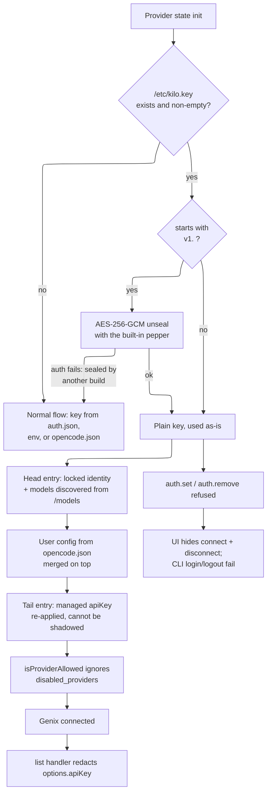
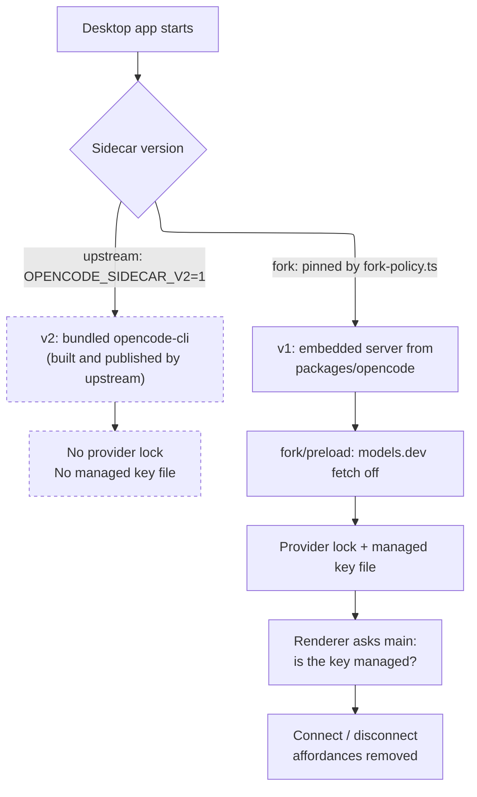
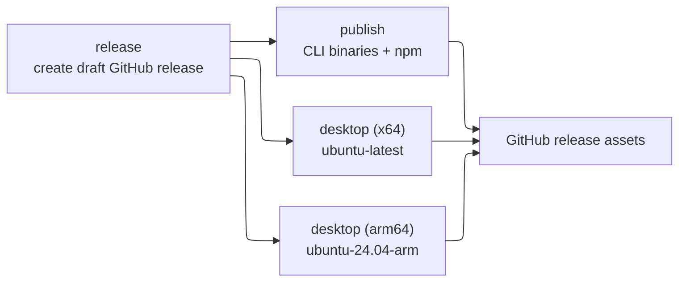

# Fork Divergence Tracking

This repository is a fork of [anomalyco/opencode](https://github.com/anomalyco/opencode). We rebase
against `upstream/dev` indefinitely, so minimising and isolating our diff is as important as the
features themselves.

This document is the authoritative reference for the fork's divergence-tracking convention.

The same fork exists on top of [Kilo-Org/kilocode](https://github.com/Kilo-Org/kilocode) (itself a
fork of opencode). The two share the marker convention, the provider identity, the managed key file
path, and the sealing pepper — a host provisioned with a key serves either build.

## Marker token: `fork_change`

| Change shape | Marker |
|---|---|
| One line | Trailing `// fork_change` |
| Multi-line block | `// fork_change start` and `// fork_change end` |
| New file in shared path | Top-level `// fork_change - new file` |
| JSX or TSX | JSX comment equivalents: `{/* fork_change */}` |
| YAML / TOML / Nix / shell / Dockerfile | `# fork_change` |

### When markers are required

Any edit to a shared upstream-owned file must be annotated. That covers `packages/opencode/`,
`packages/core/`, `packages/tui/`, `packages/ui/`, `packages/app/`, `packages/desktop/`,
`packages/script/`, `packages/sdk/`, `packages/storybook/`, `script/`, `nix/`, `.github/`, and
`github/`.

Two shapes of marker are worth knowing before editing `.tsx`, because the checker requires a marker
on **every** changed line, not just above the change:

| Position | Marker |
|---|---|
| JSX children | `{/* fork_change start */}` … `{/* fork_change end */}` around the elements |
| JSX attribute | inside the expression: `when={cond() /* fork_change */}` — a `{/* … */}` between attributes is not valid JSX |

### When markers are NOT required

- `packages/core/src/fork/**` — fork-specific source code
- `packages/core/test/fork/**` — fork-specific tests (provider lock, managed key file, key sealing, gateway discovery)
- `packages/opencode/src/fork/**` — the CLI-only preload
- `packages/app/src/fork/**` — renderer-side fork policy
- `packages/desktop/src/main/fork-policy.ts` — main-process fork policy
- Any path containing `fork` in a directory or file name

## Fork-owned directories

New behaviour goes in new, clearly fork-owned files.

| Prefer | Avoid |
|---|---|
| `packages/core/src/fork/` | Broad edits to shared source files |
| `packages/core/test/fork/` | Shared tests that encode only fork behaviour |
| Narrow import or injection seams in shared files | Refactors that enlarge upstream merge conflicts |

The shared modules live in `packages/core` rather than `packages/opencode` because
`packages/tui` cannot import from `packages/opencode`, and the TUI needs the managed-key check to
suppress the provider-connect dialog. Putting them in core is what avoids a second copy of the
sealing codec.

## CI guard

| Guard | When it runs |
|---|---|
| `bun run script/check-fork-annotations.ts` | Every PR touching a shared scope, via `.github/workflows/check-fork-annotations.yml` |

## CLI name

The CLI binary is `genixcode`, not `opencode`. The npm **package** names produced by
`packages/opencode/script/build.ts` are left as upstream writes them (`opencode-linux-x64`, …);
`script/fork-publish.ts` rewrites them at publish time. What changes in-tree is the executable name
and the places that produce or consume it:

| Concern | Where |
|---|---|
| Launcher stub | `packages/opencode/bin/genixcode` |
| `bin` entry | `packages/opencode/package.json` |
| `scriptName`, help-output detection | `packages/opencode/src/index.ts` |
| Compiled binary path, build user agent | `packages/opencode/script/build.ts` |
| Postinstall binary resolution | `packages/opencode/script/postinstall.mjs` |
| Runtime user agent | `packages/opencode/src/installation/index.ts` |
| Outbound `User-Agent` headers (providers, models.dev, websearch, webfetch) | `packages/core/src/**`, `packages/opencode/src/**` — grep `genixcode` |
| Container entrypoint | `packages/opencode/Dockerfile` |
| Nix install path, `mainProgram`, completions | `nix/opencode.nix` |
| WSL install and binary lookup (desktop, Windows) | `packages/desktop/src/main/wsl/runtime.ts` |

Upstream's `packages/opencode/script/publish.ts` and the root `install` script are deliberately left
alone — they publish to and download from registries and package repos this fork does not own.

## User configuration directories

Upstream keys its per-user directories on the app name `opencode`; this fork uses `genixcode`, so a
GenixCode install never reads or writes an OpenCode install's config, database, credentials or logs.
Both names come from `packages/core/src/fork/brand.ts` (`APP_DIRNAME`, `HOME_CONFIG_DIRNAME`).

| Directory | Upstream | Fork |
|---|---|---|
| XDG config (skills, commands, agents, plugins, themes, `opencode.json`, `tui.json`) | `~/.config/opencode` | `~/.config/genixcode` |
| XDG data (logs, repos) | `~/.local/share/opencode` | `~/.local/share/genixcode` |
| XDG cache (`bin`, pulled skills, models.dev) | `~/.cache/opencode` | `~/.cache/genixcode` |
| XDG state (locks) | `~/.local/state/opencode` | `~/.local/state/genixcode` |
| Temp | `$TMPDIR/opencode` | `$TMPDIR/genixcode` |
| Home-level config dotdir | `~/.opencode` | `~/.genixcode` |

Three things are deliberately **not** renamed:

- **The project dotdir stays `.opencode/`.** It is a repository convention shared with checkouts that
  other tools read, not a brand name.
- **Config filenames stay `opencode.json` / `opencode.jsonc` / `tui.json`.** Renaming them would
  invalidate every `$schema` reference and every existing project config.
- **Environment variables stay `OPENCODE_*`.** They are touched by too many call sites to be worth
  the rebase cost, and `OPENCODE_CONFIG_DIR` still overrides the config directory.

The switch is a hard one — the old `opencode`-named directories are not read as a fallback and are
not migrated. Anyone with existing config moves it by hand.

`ConfigPaths.isConfigDirectory()` in `packages/opencode/src/config/paths.ts` exists because of this
rename. Callers used to ask `dir.endsWith(".opencode")` inline to decide whether a directory returned
by `directories()` also carries its own `opencode.json` / `tui.json`; that test silently stops
matching once the home-level directory is `~/.genixcode`, which would load its skills and commands
while ignoring its config file. `packages/opencode/test/fork/config-paths.test.ts` pins both.

Note that the v2 config loader (`packages/core/src/config.ts`) reads the XDG config directory and
project `.opencode` directories only — it never walked the home-level dotdir, and still doesn't.
`~/.genixcode` is picked up by the v1 loader, exactly as `~/.opencode` was.

The root `install` script still puts the binary in `$HOME/.opencode/bin`; it is left alone along with
upstream's `publish.ts`, as noted under [CLI name](#cli-name).

## Provider lock

This fork is permanently locked to a single OpenAI-compatible provider (Genix). The lock is enforced
at the server/handler layer, not just in the UI:

- **State init** (`packages/opencode/src/provider/provider.ts`): only the locked provider survives the provider pipeline; all others are dropped.
- **List handler** (`packages/opencode/src/server/routes/instance/httpapi/handlers/provider.ts`): the `list` endpoint filters `all`, `default`, and `connected` to only the locked provider.
- **Authorize/callback handlers**: OAuth authorization is rejected for any non-locked provider.
- **authSet/authRemove handlers** (`handlers/control.ts`): direct API credential storage is rejected for any non-locked provider.
- **models.dev fetch**: forced off at startup via `packages/opencode/src/fork/preload.ts`; no network request to the catalog endpoint.

The provider identity is hardcoded in `packages/core/src/fork/lock.ts`:

| Field | Value |
|---|---|
| ID | `genix` |
| Display Name | `Genix` |
| Base URL | `https://ai.gateway.genixventures.com/v1` |
| AI SDK npm | `@ai-sdk/openai-compatible` |

The user supplies the remaining configuration (API key and model list) via normal provider config in
`opencode.json`:

```jsonc
{
  "provider": {
    "genix": {
      "options": { "apiKey": "your-api-key" },
      "models": {
        "your-model-id": { "name": "Your Model" }
      }
    }
  }
}
```

## Managed API key file

When `/etc/kilo.key` exists and holds a usable key, that key is the Genix API key. The user no longer
owns the credential: the key is loaded automatically, the provider is always in the connected state,
and connect/disconnect is refused everywhere. Deleting the file restores the normal interactive login
flow.

The file holds **either** the plain key **or** a *sealed* blob — see [Sealed key files](#sealed-key-files) below.

The path is a fixed system location, not a per-user one — deliberately outside anything an
unprivileged user can write, so a machine can be provisioned with a key its users cannot change. On
Windows it resolves against the current drive root (`C:\etc\kilo.key`). `KILO_FORK_KEY_FILE`
overrides the path; the test preloads point it at a path that never exists so tests never pick up a
real key, and the fork tests point it at a temp file since `/etc` is not writable under test.

The path and the `KILO_FORK_*` env var names are shared with the kilocode-based fork deliberately, so
one provisioned host serves both builds.

User-facing messages say only that the key is "embedded" — they never name the path. The key is
provisioned by whoever administers the machine, and the location is not the user's business.

| Concern | Where |
|---|---|
| Path resolution, key read | `packages/core/src/fork/key-file.ts` |
| Sealed-blob codec | `packages/core/src/fork/key-seal.ts` |
| `key seal` / `key status` commands | `packages/opencode/src/cli/cmd/key.ts` |
| Config entries carrying the key | `packages/core/src/fork/lock.ts` (`lockedManagedEntry`, `lockedProviderManaged`) |
| Model discovery from the gateway | `packages/core/src/fork/gateway.ts` |
| Key injection, force-enable, `npm` pin | `packages/opencode/src/provider/provider.ts` |
| `auth.set` / `auth.remove` refusal | `packages/opencode/src/server/routes/instance/httpapi/handlers/control.ts` |
| Key redaction from `provider.list` | `.../httpapi/handlers/provider.ts` |
| `providers login` / `providers logout` refusal | `packages/opencode/src/cli/cmd/providers.ts` |
| TUI connect-dialog refusal | `packages/tui/src/component/dialog-provider.tsx` |



Mechanics worth knowing:

- **Key precedence.** The locked identity is injected as a *head* config entry (before user config, so
  `opencode.json` can still refine name/models), and the managed key as a *tail* entry (after user
  config, so an `options.apiKey` in `opencode.json` cannot shadow it).
- **The tail entry also pins `baseURL`.** The head entry's `baseURL` is merged *under* user config, so
  an `options.baseURL` in `opencode.json` would win — and the managed key would then be sent as a
  bearer token to a user-chosen endpoint. `provider.ts` prefers `options.baseURL` over the per-model
  `api.url`, so pinning it in the tail is what decides where requests actually go.
- **The SDK package is pinned per model.** `npm` is user-settable both per provider and per model, it
  accepts a bare package name or a `file://` path, and the package it names is loaded and handed the
  API key. While a managed key is in play, every model of the locked provider has `api.npm` forced
  back to `@ai-sdk/openai-compatible`. This cannot be done from the tail config entry: model records
  are only created by entries that *list* models, and the tail deliberately lists none — so it happens
  in the final provider/model normalisation pass in `provider.ts`.
- **Always connected.** A provider with zero models is dropped from the provider map, so the model
  list is discovered from the gateway's OpenAI-compatible `/models` endpoint at provider state init.
  Discovery is memoised per process and never throws — an unreachable gateway leaves whatever models
  config already supplies. `isProviderAllowed` also ignores `disabled_providers` while the file
  exists, so a disconnect performed *before* the file was dropped in cannot keep it disconnected.
- **No key broadcast.** `options` is part of the public provider shape, so the `list` handler redacts
  `options.apiKey` while the key is managed — no client receives the secret.
- **Enforcement is server-side.** The UI changes only remove dead affordances; `auth.set` and
  `auth.remove` are refused at the handler layer, so a direct API or CLI call cannot bypass the lock.

### Sealed key files

A plain `/etc/kilo.key` has two operational problems: anyone who can read the file walks away with a
working credential, and the raw key has to travel through whatever provisions the machine. Sealing
addresses both without changing anything about how the key is *used*.

A sealed file holds one line:

```
v1.<base64url(nonce || tag || ciphertext)>
```

Produce it with the CLI — the key comes from stdin so it stays out of the shell history and out of
the process list:

```bash
printf %s "$GENIX_API_KEY" | genixcode key seal
```

`genixcode key status` reports what a host currently has (`plain`, `sealed`, `absent`, or sealed by a
build that cannot unseal it) plus a short fingerprint of the key, so you can confirm a host holds the
key you provisioned without either side printing it. There is deliberately no `key unseal`.

**This is obfuscation, not secrecy.** The unsealing secret ships inside the CLI, because that is
exactly the thing that has to be able to use the key — so anyone with a build can recover the
plaintext from a blob. Minification does not help: it renames identifiers, never string contents, so
the pepper survives in the compiled binary, next to the `createDecipheriv` call that uses it. Nor is
that even the easy path — a local user can proxy the gateway hostname and read the `Authorization`
header without touching the file at all. **Anyone who can run the client can obtain the key, by
construction.** A sealed blob still deserves the same handling as a secret; do not commit one to a
public repo. What it does buy:

- `cat /etc/kilo.key` no longer prints a usable credential, so the key stops leaking into
  screenshots, shoulder-surfing, support bundles, and logs that slurp the file.
- The blob is useless to generic tooling — it cannot be pasted into `curl` or another
  OpenAI-compatible client to reach the gateway.
- Provisioning pipelines (Terraform state, CI logs, artefact stores) carry the blob, not the key.

#### Provisioning with Terraform

Seal once, out of band, then treat the blob as the input to provisioning. The plain key never enters
Terraform, so it never lands in state or in a plan output:

```hcl
variable "genix_sealed_key" {
  description = "Output of `genixcode key seal`. Obfuscated, not secret — see FORK.md."
  type        = string
  sensitive   = true
}

resource "aws_instance" "workstation" {
  # ...
  user_data = <<-EOT
    #cloud-config
    write_files:
      - path: /etc/kilo.key
        owner: root:root
        permissions: "0644"
        content: ${var.genix_sealed_key}
  EOT
}
```

Three properties make the blob easy to feed through this kind of plumbing:

- **Single-line and ASCII-only.** base64url plus a `v1.` prefix — no `+`, `/`, `=`, quotes,
  or newlines, so it drops into HCL strings, `.tfvars`, cloud-init YAML, JSON, and SSM / Secrets
  Manager parameters with no escaping or heredoc care.
- **Deterministic.** Sealing the same key always produces the same blob (the GCM nonce is derived
  from the plaintext, synthetic-IV style, rather than drawn at random). Re-running `key seal` in a
  pipeline does not produce a spurious diff on every `terraform plan`.
- **Self-contained.** No sidecar nonce or salt file to provision alongside it.

The file only needs to be root-owned and non-writable by users — `0644` is enough, since the point of
the mode is to stop users *changing* the key, and sealing is what stops them reading a usable one.

#### Mechanics

- **Format.** AES-256-GCM. Keys are `HMAC-SHA256(pepper, "genix/v1/<purpose>")` — HMAC rather than
  a password KDF because the pepper is already high-entropy, and because `managedKey()` is called on
  every provider state init and must stay cheap. The version string is passed as GCM AAD, so a v1
  blob cannot be replayed under a later format.
- **Authenticated, so failure is clean.** A corrupted blob, or one sealed by a build with a different
  pepper, fails the tag check and reads as *no managed key at all* — the normal interactive login flow
  takes over. It never decrypts to garbage that would later surface as a mysterious 401 from the
  gateway.
- **Determinism has one cost.** Because the nonce is derived from the plaintext, two hosts sharing a
  key have identical blobs, so a blob reveals key equality. That is not worth protecting here, and a
  re-sealing diff on every plan is a real operational cost.
- **Only server-side controls change the picture.** Short-lived gateway tokens, one revocable key per
  host, and gateway-side spend/rate caps make extraction detectable and containable. Sealing and the
  config pins above raise the effort; they do not move the trust boundary off the user's machine.
- **The pepper is not in this repository.** It lives in a file outside the working tree, is read
  once at build time, and is baked into the binary through a Bun `define` — see
  [The sealing pepper](#the-sealing-pepper). A build with no pepper file fails; it does not fall
  back to a placeholder, because a binary sealed under the wrong pepper reads every already
  provisioned host's key file as *no managed key at all*.
- **Rotating the pepper is a format break.** `KILO_FORK_KEY_PEPPER` overrides it — used by the tests
  to prove a foreign blob is rejected, and available to anyone building their own CLI from source. It
  grants an attacker nothing: sealing under a pepper of your choosing produces a blob only your own
  build can read. But changing the shipped value invalidates every provisioned host, and breaks
  interoperability with the kilocode-based fork, so the golden-vector tests fail deliberately loudly
  if it moves. Those tests need the real pepper, so they skip themselves — with a warning naming the
  path they looked in — on a checkout that has no pepper file.

## Branding

The fork replaces upstream's visual identity with Genix branding, using the brand blue `#0186CD`.

| Surface | Where | Change |
|---|---|---|
| TUI home-screen wordmark | `packages/tui/src/logo.ts`, `packages/tui/src/component/logo.tsx` | `open`→`genix` block art; the `code` half is drawn in Genix blue (truecolor) instead of `theme.text` |
| CLI help banner | `packages/opencode/src/cli/ui.ts` | Same wordmark in plain text; the right half uses **256-colour** index 32 (`#0087d7`, closest to `#0186CD`) rather than a 24-bit escape, so it renders in terminals that don't advertise `COLORTERM=truecolor` |
| Run splash | `packages/opencode/src/cli/cmd/run/splash.ts`, `.../run/theme.ts` | `OpenCode` → `GenixCode`, coloured by a dedicated `logo` entry added to `RunSplashTheme`, set to `#0186CD` as **truecolor** (not palette-indexed, so terminals with a remapped 256-colour cube still show blue) |

| Desktop app and web UI | see [Desktop app](#desktop-app) | product name, application ids, deep-link scheme, icons, wordmark, and a dictionary seam that renames translated copy in ~127 locale files without editing them |

The documentation site under `packages/web/` and its translations still describe upstream's `opencode`
binary; they are not part of what this fork ships.

## Desktop app

`packages/desktop/` is an Electron shell around the same agent the CLI runs: the v1 sidecar it spawns
is the server bundled from `packages/opencode`, so the [provider lock](#provider-lock) and the
[managed key file](#managed-api-key-file) already hold there without a second implementation. One
gap had to be closed for that to be true — `packages/opencode/src/node.ts`, the entry point the
desktop bundles, did not import the fork preload, so the embedded server still called models.dev on
startup. It does now, the same way `index.ts` does for the CLI.

What the rest of this section covers is everything *around* the agent: a second agent upstream ships
beside it, the identity the app installs under, and the handful of places the shell reaches out to
upstream's infrastructure.



### The second agent

Upstream can back the app two ways. The default is the embedded server; setting `OPENCODE_SIDECAR_V2=1`
switches to `opencode-cli`, a separately published binary that `scripts/prebuild.ts` downloads from
the `@opencode-ai/cli-<platform>` npm packages and bundles into the app.

That binary is built by upstream, not from this tree. It carries neither the provider lock nor the
managed key file, and it talks to whatever upstream configures — so bundling it would put an unlocked
agent inside a locked build, one env var away from running. The fork removes it at three levels:

| Level | Where |
|---|---|
| Not downloaded | `scripts/prebuild.ts`, `scripts/predev.ts`, `scripts/utils.ts` (`downloadCliToResources` and its target table are gone) |
| Not bundled | `electron-builder.config.ts` — the `opencode-cli*` `extraResources` entry and its `files` exclusion |
| Not reachable | `src/main/fork-policy.ts` pins the sidecar to `v1`; `src/main/background-cli.ts` throws if the path is ever re-entered |

`background-cli.ts` keeps its body so the module still merges cleanly on rebase — the guard is at the
top of the function, not a deletion.

### Identity

| Surface | Upstream | Fork |
|---|---|---|
| Product name | OpenCode / Beta / Dev | GenixCode / Beta / Dev |
| Application id | `ai.opencode.desktop[.beta|.dev]` | `com.genixventures.genixcode[.beta|.dev]` |
| Deep-link scheme | `opencode://` | `genixcode://` |
| Artefacts | `opencode-desktop-${os}-${arch}` | `genixcode-desktop-${os}-${arch}` |
| Linux package | `opencode[-beta|-dev]` | `genixcode[-beta|-dev]` |
| Linux artefacts | `.deb`, `.rpm`, AppImage | `.deb` only |
| AppStream metainfo | Anomaly Innovations, opencode.ai, upstream tracker, upstream screenshot | Genix Ventures; outbound links dropped |
| Icons | hand-made, per channel | generated by `icons/fork-generate.py` from the `Splash` mark in Genix blue |
| Wordmark | `opencode` block letters | `genixcode`, "code" half in Genix blue (`packages/ui/src/components/logo.tsx`) |

The identity lives in `packages/core/src/fork/brand.ts`. `electron-builder.config.ts` is the one
exception: electron-builder loads it with its own TypeScript loader, outside bun and outside the
workspace resolver, so it repeats the literals and `electron-builder.config.test.ts` asserts the two
agree — plus that no upstream identity, publish feed, or bundled CLI has crept back in.

Upstream's legacy `opencode-desktop.desktop` launcher entry is gone. It existed to keep GNOME/KDE
pins working across an upstream app-id change; this fork never shipped under that id.

Linux builds emit a `.deb` and nothing else. Fork desktop builds are distributed internally to
Debian/Ubuntu machines, so upstream's AppImage and `.rpm` were build time and release weight nobody
installed. The branded package name (`genixcode[-beta|-dev]`) rides on the `deb` options now — it
used to sit on `rpm`, which was the only target upstream gave one. Adding a target back means
listing it in `linux.target` *and* giving it a `packageName`: without one, electron-builder falls
back to the sanitised product name, which is not a valid Debian package name. Upstream's
`.github/workflows/publish.yml` still installs `rpm` and still globs `*.AppImage`/`*.rpm` when
uploading release assets; it is left untouched because the fork does not release desktop builds
through it (see [Publishing](#publishing)), and the globs are under `nullglob`.

### Renaming the copy

The CLI, the TUI wordmark and the run splash carry their rename as hand-edited literals — there are
only a handful. The desktop app cannot: its user-visible copy lives in ~65 locale dictionaries in
`packages/app/src/i18n/` and another ~62 in `packages/desktop/src/renderer/i18n/`, and rewriting them
would trade a small diff for a several-thousand-line one that conflicts on every upstream
translation update.

So the rename happens at the seam. `rebrandDict()` from `packages/core/src/fork/brand.ts` rewrites
dictionary *values* as they load — never keys, which are identifiers like
`dialog.provider.opencode.note`:

| Seam | File |
|---|---|
| Shared app + UI dictionaries | `packages/app/src/context/language.tsx` |
| Desktop-only dictionaries | `packages/desktop/src/renderer/i18n/index.ts` |
| Native menus and dialogs | `packages/desktop/src/main/native-translations.ts` (`nativeT` rebrands on the way out, covering the English fallback and any bundle from an older renderer) |

The upshot: a test asserting exact English copy will see the rebranded string. `wsl/servers.test.ts`
is the one that does.

### What no longer reaches upstream

| Call | Upstream behaviour | Fork |
|---|---|---|
| models.dev catalogue | fetched at server start | off — `packages/opencode/src/node.ts` imports the fork preload |
| Release notes | `opencode.ai/changelog.json` on every launch | off — `forkReleaseNotesEnabled()` in `packages/app/src/fork/policy.ts` |
| Auto-update | electron-updater against `anomalyco/opencode` releases | no feed: no `publish` block, `UPDATER_ENABLED = false` |
| Help menu | opencode.ai docs, upstream Discord, upstream issue tracker | removed — only Export Logs remains |
| Help buttons and the error page's report link | `opencode.ai/desktop-feedback` | hidden while `forkSupportURL()` is undefined |
| WSL install | `curl -fsSL https://opencode.ai/install \| bash` | `npm install -g genixcode@<version>`; `resolveWslOpencode` looks for `genixcode` |

The auto-update and the issue-tracker links are the two that matter most. An update feed pointed at
upstream would quietly turn a Genix build into an OpenCode one; a "Report Bug" item pointed at a
public tracker would carry internal failure reports out of the company.

`forkSupportURL()` returns `undefined` because the fork has no public docs, forum or tracker to offer
— support goes through internal channels. Every Help control checks it, so giving it an internal URL
one day turns them all back on at once.

### Left alone

`scripts/copy-bundles.ts` and `scripts/finalize-latest-{json,yml}.ts` still carry upstream's artefact
names. They are driven only by upstream's `publish.yml` and `script/publish.ts`, which this fork
deliberately does not touch — same reasoning as the CLI's publish script: they push to repositories
and update feeds the fork does not own. `migrate.ts` keeps its body too, but the migration itself is
off (`forkTauriMigrationEnabled()`): it imports settings and session data from upstream's Tauri-era
app, and this build has no such lineage.

### Managed key in the renderer

The TUI reads `/etc/kilo.key` directly to suppress its connect dialog. The desktop renderer is a
browser context and cannot, so the main process answers a sync IPC channel
(`src/main/fork-policy.ts`) and the preload reads it once at load into `window.api.forkManagedKey`.
Only the boolean crosses — the key itself never does, the same reason `provider.list` redacts it.

`packages/app/src/fork/policy.ts` exposes that to the shared UI, which drops the affordances the
server would refuse anyway:

| Affordance | Hidden when |
|---|---|
| Connect | a managed key is present |
| Disconnect | a managed key is present |
| "View all providers" | always — the lock leaves nothing to browse |
| Add custom provider | always — the lock rejects every other provider id |

The web app in `packages/app/` has no preload, so `forkManagedKey()` is false there and upstream's
affordances stay as written. Enforcement is server-side regardless; this only removes dead controls.

## Rebase workflow

1. Rebase against `upstream/dev`.
2. Resolve conflicts on shared files — look for `fork_change` markers to identify our changes.
3. Run `bun run script/check-fork-annotations.ts --base <upstream-ref>` to verify all fork changes are still annotated.
4. Fork-owned files under `packages/core/src/fork/` and `packages/core/test/fork/` should never conflict with upstream.
5. Re-run the CLI help snapshots (`bun test test/cli/help --update-snapshots` in `packages/opencode`) when upstream changes a command surface.

## Local builds

### The sealing pepper

Every build of the CLI and of the desktop app's embedded server needs the key-sealing pepper
(see [Mechanics](#mechanics)), which is deliberately **not** in the repository. It is read from a
file outside the working tree and baked into the binary; a build without it fails with a message
naming the path it looked in.

```bash
mkdir -p ~/.config/genix
printf %s "$GENIX_KEY_PEPPER" > ~/.config/genix/key-pepper
chmod 600 ~/.config/genix/key-pepper
```

| | |
|---|---|
| Default path | `~/.config/genix/key-pepper` (`$XDG_CONFIG_HOME` is honoured) |
| Path override | `KILO_FORK_KEY_PEPPER_FILE` — used by CI to point at a runner temp path |
| Value override | `KILO_FORK_KEY_PEPPER` — the pepper itself, no file; also the tests' override |
| Contents | the pepper and nothing else, one line; surrounding whitespace is trimmed |
| Resolution order | `packages/core/src/fork/pepper.ts` |

The workflows materialise it from the `GENIX_KEY_PEPPER` repository secret before building. The
value is the one this fork has always shipped: it must not change, or every provisioned host needs
re-sealing.

Running from source — `bun dev`, `bun test` — there is no build and so no `define`, and the same file
is read at runtime instead. A dev machine without the pepper file still runs: sealed key files simply
read as *no managed key*, and the normal interactive login flow applies.

`nix/opencode.nix` builds inside a sandbox with no access to `~/.config`, so a nix build needs
`KILO_FORK_KEY_PEPPER` (or a `KILO_FORK_KEY_PEPPER_FILE` path) threaded into the derivation. The
fork does not ship nix builds, and `nix-eval.yml` only evaluates.

### Binaries

The CLI:

```bash
cd packages/opencode
bun run build --single --skip-install
```

Output goes to `packages/opencode/dist/opencode-<platform>-<arch>/bin/genixcode`.

The desktop app, from `packages/desktop` (needs a desktop-capable machine — it runs Electron):

```bash
bun run build && bun run package
```

`build` compiles the renderer and main bundles and, via `prebuild`, the embedded server from
`packages/opencode`; `package` runs electron-builder. Artefacts land in `packages/desktop/dist/` as
`genixcode-desktop-<os>-<arch>.<ext>` — on Linux that is a `.deb` and nothing else
(see [Identity](#identity)). `<arch>` is the Debian architecture rather than
electron-builder's own name for it, so an x64 build is `genixcode-desktop-linux-amd64.deb`;
`fork-publish.yml` checks for that spelling when it verifies the release assets.
`OPENCODE_CHANNEL` selects `dev` (default), `beta` or `prod`,
which decides the application id, product name and icons. `bun dev:desktop` from the repo root runs
it unpackaged. CI builds the Linux `.deb` for every release — see [Publishing](#publishing).

## Publishing

Fork builds are published via `.github/workflows/fork-publish.yml`, which triggers on `v*` tags and
manual `workflow_dispatch`. It runs three jobs:



`release` works the version out from the tag (or the `workflow_dispatch` input) and creates the draft
release, because the two build jobs both attach their artefacts to it with `gh release upload` and
therefore need it to exist first.

`publish` runs `packages/opencode/script/fork-publish.ts`, which builds every platform binary,
rewrites the platform package names from `opencode-*` to `genixcode-*`, assembles the `genixcode`
super-package (launcher stub + postinstall + optional dependencies), and publishes the lot to npm.

`desktop` builds the Linux `.deb` for x64 and arm64, each on a runner of its own architecture, and
uploads it to the release. It is Linux-only: macOS needs signing and notarisation credentials and
Windows a signing certificate, neither of which the fork holds. Each architecture builds natively
because `electron.vite.config.ts` resolves the node-pty and watcher native modules for the *host*
architecture, so a cross-build would bundle the wrong ones. The job passes `OPENCODE_CHANNEL=prod`
rather than the CLI's `latest`, since `electron-builder.config.ts` falls back to `dev` for any value
it does not recognise and would otherwise produce a `genixcode-dev` package under the `.dev`
application id. The app still ships with no update feed (see [Desktop app](#desktop-app)) — the
`.deb` is installed and upgraded by hand or by whatever pushes it internally.

Requires an `NPM_TOKEN` secret with publish rights to the `genixcode` package name, and a
`GENIX_KEY_PEPPER` secret holding the key-sealing pepper — `.github/actions/fork-key-pepper` writes
it to a file outside the checkout before building, for the CLI and the desktop app alike, since
[the build fails without one](#the-sealing-pepper) and the desktop app embeds the same server.
Trigger `workflow_dispatch` with "Skip npm publish" to build and attach release assets — `.deb`
included — without publishing to npm.

This workflow does not touch upstream's `publish.yml`.
