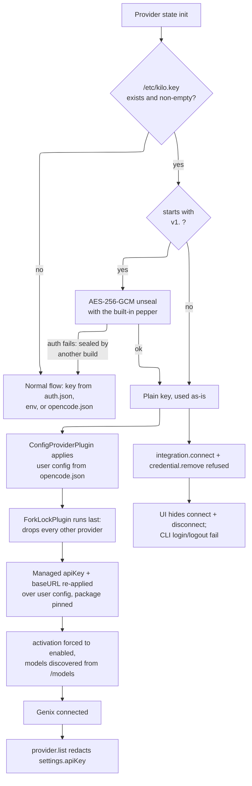
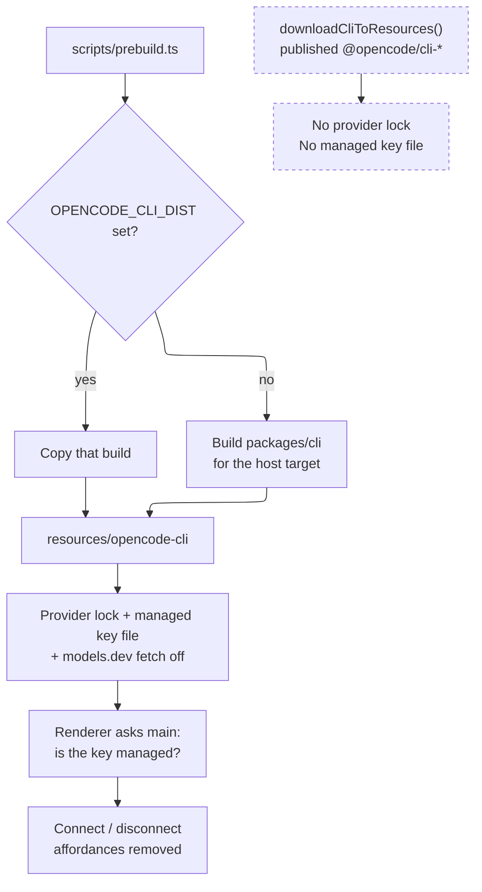
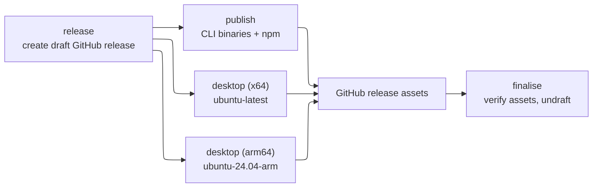

# Fork Divergence Tracking

This repository is a fork of [anomalyco/opencode](https://github.com/anomalyco/opencode). We rebase
against `upstream/dev` indefinitely, so minimising and isolating our diff is as important as the
features themselves.

This document is the authoritative reference for the fork's divergence-tracking convention.

The same fork exists on top of [Kilo-Org/kilocode](https://github.com/Kilo-Org/kilocode) (itself a
fork of opencode). The two share the marker convention, the provider identity, the managed key file
path, and the sealing pepper — a host provisioned with a key serves either build.

## Marker token: `fork_change`

| Change shape | Marker |
|---|---|
| One line | Trailing `// fork_change` |
| Multi-line block | `// fork_change start` and `// fork_change end` |
| New file in shared path | Top-level `// fork_change - new file` |
| JSX or TSX | JSX comment equivalents: `{/* fork_change */}` |
| YAML / TOML / Nix / shell / Dockerfile | `# fork_change` |

### When markers are required

Any edit to a shared upstream-owned file must be annotated. That covers `packages/cli/`,
`packages/server/`, `packages/util/`, `packages/core/`, `packages/tui/`, `packages/ui/`,
`packages/app/`, `packages/desktop/`, `packages/script/`, `packages/sdk/`, `packages/storybook/`,
`script/`, `nix/`, `.github/`, `github/`, and `.husky/`.

> Upstream v2 dissolved `packages/opencode/` into `packages/cli/`, `packages/server/`,
> `packages/core/` and `packages/util/`. The three new packages are in the list above so the same
> lines stay guarded after the move.

Two shapes of marker are worth knowing before editing `.tsx`, because the checker requires a marker
on **every** changed line, not just above the change:

| Position | Marker |
|---|---|
| JSX children | `{/* fork_change start */}` … `{/* fork_change end */}` around the elements |
| JSX attribute | inside the expression: `when={cond() /* fork_change */}` — a `{/* … */}` between attributes is not valid JSX |

### When markers are NOT required

- `packages/util/src/fork/**` — fork-specific source code (brand, provider lock, managed key file, key sealing, pepper, gateway discovery, server guard)
- `packages/util/test/fork/**` — the tests for all of the above
- `packages/core/src/fork/**` — the lock's v2 plugin, which needs core's provider/model services
- `packages/app/src/fork/**` — renderer-side fork policy
- `packages/cli/src/fork/**` — CLI-side fork policy (the updater switch)
- `packages/desktop/src/main/fork-policy.ts` — main-process fork policy
- Any path containing `fork` in a directory or file name

## Fork-owned directories

New behaviour goes in new, clearly fork-owned files.

| Prefer | Avoid |
|---|---|
| `packages/util/src/fork/` | Broad edits to shared source files |
| `packages/util/test/fork/` | Shared tests that encode only fork behaviour |
| Narrow import or injection seams in shared files | Refactors that enlarge upstream merge conflicts |

The shared modules live in `packages/util` — the workspace's leaf package — because every consumer
has to be able to reach them and `util` is the only package all of them already depend on. Two
constraints force it there specifically:

- **`packages/util/src/global.ts` needs `APP_DIRNAME`.** Upstream v2 moved `Global` (the XDG data,
  cache, config and state roots) out of core and into util. Importing core from util would be a
  cycle, so the brand module has to be at or below util.
- **`packages/cli` may not import `@opencode/core`.** Upstream enforces that boundary in
  `packages/cli/test/import-boundaries.test.ts`, and the CLI still has to refuse `auth login` /
  `auth logout` while a key is managed.

Only `packages/core/src/fork/plugin.ts` stays in core: it is the lock's v2 wiring and needs core's
`Provider`, `Model` and `App` services.

## CI guard

| Guard | When it runs |
|---|---|
| `bun run script/check-fork-annotations.ts` | Every PR touching a shared scope, via `.github/workflows/check-fork-annotations.yml` |

## CLI name

The CLI binary is `genixcode`, not `opencode`. The npm **package** names produced by
`packages/cli/script/build.ts` are left as upstream writes them (`@opencode/cli-linux-x64`, …);
`packages/cli/script/fork-publish.ts` rewrites them at publish time. What changes in-tree is the
executable name and the places that produce or consume it:

| Concern | Where |
|---|---|
| Launcher stubs | `packages/cli/bin/genixcode.cjs`, `packages/cli/bin/genixcode2.cjs` |
| `bin` entry | `packages/cli/package.json` |
| Root command name, help output | `packages/cli/src/commands/commands.ts` (falls back to `CLI_NAME` when the `OPENCODE_CLI_NAME` define is absent) |
| Compiled binary name, build user agent, `OPENCODE_CLI_NAME` define | `packages/cli/script/build.ts` |
| Node build's `OPENCODE_CLI_NAME` define | `packages/cli/vite.node.config.ts` |
| Postinstall messages (binary resolution is generic — it reads `bin` from package.json) | `packages/cli/script/postinstall.mjs` |
| Outbound `User-Agent` headers (providers, models.dev, websearch, webfetch) | `packages/core/src/app.ts` — one seam, see below |
| Container entrypoint | `packages/cli/Dockerfile` |
| Nix install path, `mainProgram`, completions | `nix/opencode.nix` |
| Remote/WSL install and binary lookup (desktop) | `packages/desktop/src/main/remote/cli.ts` |
| TUI resume hint | `packages/tui/src/mini/splash.ts` |

Upstream v2 consolidated every outbound user agent into `App.useragent(app)`, so what was roughly a
dozen scattered literals in v1 is now a **single line** in `packages/core/src/app.ts`. Upstream's
`packages/cli/script/publish.ts`, `packages/cli/script/publish-aur.ts` and the root `install` script
are deliberately left alone — they publish to and download from registries and package repos this
fork does not own.

## User configuration directories

Upstream keys its per-user directories on the app name `opencode`; this fork uses `genixcode`, so a
GenixCode install never reads or writes an OpenCode install's config, database, credentials or logs.
Both names come from `packages/util/src/fork/brand.ts` (`APP_DIRNAME`, `HOME_CONFIG_DIRNAME`), and
`packages/util/src/global.ts` is where `APP_DIRNAME` roots the XDG directories.

| Directory | Upstream | Fork |
|---|---|---|
| XDG config (skills, commands, agents, plugins, themes, `opencode.json`, `tui.json`) | `~/.config/opencode` | `~/.config/genixcode` |
| XDG data (logs, repos) | `~/.local/share/opencode` | `~/.local/share/genixcode` |
| XDG cache (`bin`, pulled skills, models.dev) | `~/.cache/opencode` | `~/.cache/genixcode` |
| XDG state (locks) | `~/.local/state/opencode` | `~/.local/state/genixcode` |
| Temp | `$TMPDIR/opencode` | `$TMPDIR/genixcode` |
| Home-level config dotdir | `~/.opencode` | `~/.genixcode` |

Three things are deliberately **not** renamed:

- **The project dotdir stays `.opencode/`.** It is a repository convention shared with checkouts that
  other tools read, not a brand name.
- **Config filenames stay `opencode.json` / `opencode.jsonc` / `tui.json`.** Renaming them would
  invalidate every `$schema` reference and every existing project config.
- **Environment variables stay `OPENCODE_*`.** They are touched by too many call sites to be worth
  the rebase cost, and `OPENCODE_CONFIG_DIR` still overrides the config directory.

The switch is a hard one — the old `opencode`-named directories are not read as a fallback and are
not migrated. Anyone with existing config moves it by hand.

### The background service registration

Renaming the XDG state root has one consequence that is not obvious from the table above, and it
cost a day of "the desktop app hangs on its splash screen" before anyone found it.

The desktop app does not talk to the CLI directly. It calls `Service.ensure()`, which watches a
small JSON registration file for a URL and password, spawning the CLI until one appears. Upstream
stores the path to that file in two places that never compare notes:

| Half | Where | Path it produces |
|---|---|---|
| Writer (CLI) | `ServiceConfig.paths` | `Global.state` + a channel-derived filename |
| Reader (any client that passes no `file`) | `fallback()` in `packages/client/src/{promise,effect}/service.ts` | hardcoded `~/.local/state/opencode/service.json` |

Upstream gets away with that because the two spellings coincide: the app directory is `opencode`,
and every channel it ships — `latest`, `dev`, `beta`, `next` — maps back to a bare `service.json`.
This fork breaks the coincidence twice over. `APP_DIRNAME` moves the writer to
`~/.local/state/genixcode/`, and `Script.channel` falls back to the current git branch, so a local
build off `fork-on-v2.0.11` writes `service-fork-on-v2.0.11.json` instead.

Either mismatch alone hangs the app, and it hangs *silently*: `ensure()` watches a file nobody
writes, so it respawns the CLI forever, and each new CLI finds its own registration, concludes a
service is already up and exits 0. No error, no crash, no log line past `background service
starting` — just the logo.

`packages/util/src/fork/service-registration.ts` is now the single spelling. The CLI names its file
through `registrationFilename()`, and the desktop passes `registrationFile(channel)` explicitly at
both call sites rather than relying on the client fallback:

| Concern | Where |
|---|---|
| Shared path, filename and channel parsing | `packages/util/src/fork/service-registration.ts` |
| CLI filename and default-channel port | `packages/cli/src/services/service-config.ts` |
| CLI channel carried alongside the version | `packages/desktop/src/main/service/desktop-cli.ts` |
| `Service.ensure()` call | `packages/desktop/src/main/service/background-service.ts` |
| Startup `Service.discover()` probe | `packages/desktop/src/main/service/sidecar-probe.ts` |

The client's own `fallback()` is left as upstream writes it. Nothing in this fork reaches it any
more, and rewriting it would mean giving `@opencode/client` — deliberately dependency-light, so
Promise consumers need neither Effect nor `@effect/platform-node` — a dependency on
`@opencode/util`.

**The home-level dotdir is gone.** v1 had two loaders, and the older one also scanned `~/.opencode`
for skills, commands, agents, plugins, themes and a config file. Keeping that working under the new
name needed a helper (`ConfigPaths.isConfigDirectory()`), because callers tested
`dir.endsWith(".opencode")` inline and that test stops matching once the directory is `~/.genixcode`.
v2 has one loader — `packages/core/src/config/discovery.ts` — and it reads the XDG config directory
plus project `.opencode` directories only. It never walked the home-level dotdir, so the helper and
its test have no v2 equivalent and are gone. `HOME_CONFIG_DIRNAME` survives in `brand.ts` because the
remote and WSL installers still use it as the install prefix (`$HOME/.genixcode/bin/genixcode`).

The root `install` script still puts the binary in `$HOME/.opencode/bin`; it is left alone along with
upstream's `publish.ts`, as noted under [CLI name](#cli-name).

## Provider lock

This fork is permanently locked to a single OpenAI-compatible provider (Genix). The lock is enforced
in the provider pipeline and at the server/handler layer, not just in the UI:

- **Provider pipeline** (`packages/core/src/fork/plugin.ts`): every provider but the locked one is removed from the provider map, and every integration but the locked one from the connect surface.
- **List handler** (`packages/server/src/handlers/provider.ts`): `provider.list` and `provider.get` redact `settings.apiKey` while the key is managed.
- **Connect handlers** (`packages/server/src/handlers/integration.ts`): `integration.connect.key` and `integration.oauth.connect` are rejected for any non-locked integration, and for any integration at all while a key is managed.
- **Credential handler** (`packages/server/src/handlers/credential.ts`): `credential.remove` is rejected while a key is managed.
- **models.dev fetch**: forced off in `packages/cli/src/server-process.ts`; no network request to the catalog endpoint.

The provider identity is hardcoded in `packages/util/src/fork/lock.ts`:

| Field | Value |
|---|---|
| ID | `genix` |
| Display Name | `Genix` |
| Base URL | `https://ai.gateway.genixventures.com/v1` |
| Provider package | `@opencode/ai/providers/openai-compatible` |

### How the lock attaches to v2

v1 enforced this by splicing two entries into the `configProviders` array that provider state init
folded over: a *head* entry carrying the locked identity (merged **under** user config, so
`opencode.json` could still refine the name and model list) and a *tail* entry carrying the managed
key and the gateway URL (merged **over** user config, so neither could be shadowed).

v2 has no such array. Providers are records in a `State` map, and every contributor — including
upstream's own `ConfigProviderPlugin` — mutates them through `ctx.provider.transform`. Transforms
apply in plugin registration order, so `ForkLockPlugin` is registered **last** in
`packages/core/src/plugin/internal.ts`, which reproduces the v1 tail's precedence exactly; the same
transform fills in whatever user config did not set, which is the head's job.

The user supplies the remaining configuration (API key and model list) via normal provider config in
`opencode.json`:

```jsonc
{
  "provider": {
    "genix": {
      "options": { "apiKey": "your-api-key" },
      "models": {
        "your-model-id": { "name": "Your Model" }
      }
    }
  }
}
```

## Managed API key file

When `/etc/kilo.key` exists and holds a usable key, that key is the Genix API key. The user no longer
owns the credential: the key is loaded automatically, the provider is always in the connected state,
and connect/disconnect is refused everywhere. Deleting the file restores the normal interactive login
flow.

The file holds **either** the plain key **or** a *sealed* blob — see [Sealed key files](#sealed-key-files) below.

The path is a fixed system location, not a per-user one — deliberately outside anything an
unprivileged user can write, so a machine can be provisioned with a key its users cannot change. On
Windows it resolves against the current drive root (`C:\etc\kilo.key`). `KILO_FORK_KEY_FILE`
overrides the path; the test preloads point it at a path that never exists so tests never pick up a
real key, and the fork tests point it at a temp file since `/etc` is not writable under test.

The path and the `KILO_FORK_*` env var names are shared with the kilocode-based fork deliberately, so
one provisioned host serves both builds.

User-facing messages say only that the key is "embedded" — they never name the path. The key is
provisioned by whoever administers the machine, and the location is not the user's business.

| Concern | Where |
|---|---|
| Path resolution, key read | `packages/util/src/fork/key-file.ts` |
| Sealed-blob codec | `packages/util/src/fork/key-seal.ts` |
| `key seal` / `key status` commands | `packages/cli/src/commands/handlers/key/` |
| The settings the lock pins | `packages/util/src/fork/lock.ts` (`lockedManagedSettings`, `lockedProviderManaged`) |
| Model discovery from the gateway | `packages/util/src/fork/gateway.ts` |
| Key injection, force-enable, package pin | `packages/core/src/fork/plugin.ts` |
| Connect / disconnect refusal, key redaction | `packages/util/src/fork/guard.ts`, applied in `packages/server/src/handlers/{integration,credential,provider}.ts` |
| `auth login` / `auth logout` refusal | `packages/cli/src/commands/handlers/auth/{login,logout}.ts` |
| TUI connect-dialog refusal | `packages/tui/src/component/dialog-integration.tsx` |



Mechanics worth knowing:

- **Key precedence.** `ForkLockPlugin` runs after upstream's config provider plugin, so the managed
  key and gateway URL land *over* user config and an `options.apiKey` in `opencode.json` cannot
  shadow them. Anything the user set that the lock does not pin — the display name, extra models —
  survives.
- **`baseURL` is pinned alongside the key.** A `baseURL` in `opencode.json` would otherwise win, and
  the managed key would then be sent as a bearer token to a user-chosen endpoint — key exfiltration
  with no reverse engineering required.
- **The provider package is pinned per model.** `package` is user-settable both per provider and per
  model, and the package it names is loaded and handed the API key, so leaving it open lets an
  `opencode.json` entry exfiltrate the managed key (and run arbitrary code) without touching the key
  file. While a managed key is in play, every model of the locked provider has it forced back to
  `@opencode/ai/providers/openai-compatible`.
- **Always connected.** The Genix gateway has no models.dev catalogue entry, so the model list is
  discovered from its OpenAI-compatible `/models` endpoint and registered by the plugin. Discovery is
  memoised per process and never throws — an unreachable gateway leaves whatever models config
  already supplies. The plugin also forces `activation: "enabled"`, so a stale `provider.use` deny
  policy (a disconnect performed *before* the file was dropped in) cannot keep it disconnected.
- **No key broadcast.** `settings` is part of the public provider shape, so the `provider.list` and `provider.get` handlers redact
  `settings.apiKey` while the key is managed — no client receives the secret.
- **Enforcement is server-side.** The UI changes only remove dead affordances; the connect and
  credential-removal handlers refuse outright, so a direct API or CLI call cannot bypass the lock.

### Sealed key files

A plain `/etc/kilo.key` has two operational problems: anyone who can read the file walks away with a
working credential, and the raw key has to travel through whatever provisions the machine. Sealing
addresses both without changing anything about how the key is *used*.

A sealed file holds one line:

```
v1.<base64url(nonce || tag || ciphertext)>
```

Produce it with the CLI — the key comes from stdin so it stays out of the shell history and out of
the process list:

```bash
printf %s "$GENIX_API_KEY" | genixcode key seal
```

`genixcode key status` reports what a host currently has (`plain`, `sealed`, `absent`, or sealed by a
build that cannot unseal it) plus a short fingerprint of the key, so you can confirm a host holds the
key you provisioned without either side printing it. There is deliberately no `key unseal`.

**This is obfuscation, not secrecy.** The unsealing secret ships inside the CLI, because that is
exactly the thing that has to be able to use the key — so anyone with a build can recover the
plaintext from a blob. Minification does not help: it renames identifiers, never string contents, so
the pepper survives in the compiled binary, next to the `createDecipheriv` call that uses it. Nor is
that even the easy path — a local user can proxy the gateway hostname and read the `Authorization`
header without touching the file at all. **Anyone who can run the client can obtain the key, by
construction.** A sealed blob still deserves the same handling as a secret; do not commit one to a
public repo. What it does buy:

- `cat /etc/kilo.key` no longer prints a usable credential, so the key stops leaking into
  screenshots, shoulder-surfing, support bundles, and logs that slurp the file.
- The blob is useless to generic tooling — it cannot be pasted into `curl` or another
  OpenAI-compatible client to reach the gateway.
- Provisioning pipelines (Terraform state, CI logs, artefact stores) carry the blob, not the key.

#### Provisioning with Terraform

Seal once, out of band, then treat the blob as the input to provisioning. The plain key never enters
Terraform, so it never lands in state or in a plan output:

```hcl
variable "genix_sealed_key" {
  description = "Output of `genixcode key seal`. Obfuscated, not secret — see FORK.md."
  type        = string
  sensitive   = true
}

resource "aws_instance" "workstation" {
  # ...
  user_data = <<-EOT
    #cloud-config
    write_files:
      - path: /etc/kilo.key
        owner: root:root
        permissions: "0644"
        content: ${var.genix_sealed_key}
  EOT
}
```

Three properties make the blob easy to feed through this kind of plumbing:

- **Single-line and ASCII-only.** base64url plus a `v1.` prefix — no `+`, `/`, `=`, quotes,
  or newlines, so it drops into HCL strings, `.tfvars`, cloud-init YAML, JSON, and SSM / Secrets
  Manager parameters with no escaping or heredoc care.
- **Deterministic.** Sealing the same key always produces the same blob (the GCM nonce is derived
  from the plaintext, synthetic-IV style, rather than drawn at random). Re-running `key seal` in a
  pipeline does not produce a spurious diff on every `terraform plan`.
- **Self-contained.** No sidecar nonce or salt file to provision alongside it.

The file only needs to be root-owned and non-writable by users — `0644` is enough, since the point of
the mode is to stop users *changing* the key, and sealing is what stops them reading a usable one.

#### Mechanics

- **Format.** AES-256-GCM. Keys are `HMAC-SHA256(pepper, "genix/v1/<purpose>")` — HMAC rather than
  a password KDF because the pepper is already high-entropy, and because `managedKey()` is called on
  every provider state init and must stay cheap. The version string is passed as GCM AAD, so a v1
  blob cannot be replayed under a later format.
- **Authenticated, so failure is clean.** A corrupted blob, or one sealed by a build with a different
  pepper, fails the tag check and reads as *no managed key at all* — the normal interactive login flow
  takes over. It never decrypts to garbage that would later surface as a mysterious 401 from the
  gateway.
- **Determinism has one cost.** Because the nonce is derived from the plaintext, two hosts sharing a
  key have identical blobs, so a blob reveals key equality. That is not worth protecting here, and a
  re-sealing diff on every plan is a real operational cost.
- **Only server-side controls change the picture.** Short-lived gateway tokens, one revocable key per
  host, and gateway-side spend/rate caps make extraction detectable and containable. Sealing and the
  config pins above raise the effort; they do not move the trust boundary off the user's machine.
- **The pepper is not in this repository.** It lives in a file outside the working tree, is read
  once at build time, and is baked into the binary through a Bun `define` — see
  [The sealing pepper](#the-sealing-pepper). A build with no pepper file fails; it does not fall
  back to a placeholder, because a binary sealed under the wrong pepper reads every already
  provisioned host's key file as *no managed key at all*.
- **Rotating the pepper is a format break.** `KILO_FORK_KEY_PEPPER` overrides it — used by the tests
  to prove a foreign blob is rejected, and available to anyone building their own CLI from source. It
  grants an attacker nothing: sealing under a pepper of your choosing produces a blob only your own
  build can read. But changing the shipped value invalidates every provisioned host, and breaks
  interoperability with the kilocode-based fork, so the golden-vector tests fail deliberately loudly
  if it moves. Those tests need the real pepper, so they skip themselves — with a warning naming the
  path they looked in — on a checkout that has no pepper file.

## Branding

The fork replaces upstream's visual identity with Genix branding, using the brand blue `#0186CD`.

| Surface | Where | Change |
|---|---|---|
| TUI home-screen wordmark | `packages/tui/src/logo.ts`, `packages/tui/src/component/logo.tsx` | `open`→`genix` block art; the `code` half is drawn in Genix blue (truecolor) instead of `theme.text.base` |
| TUI resume hint | `packages/tui/src/mini/splash.ts` | `opencode mini -s …` → `genixcode mini -s …` |

Two v1 surfaces have no v2 equivalent. The CLI help banner drew the same wordmark in plain text from
`packages/opencode/src/cli/ui.ts`; v2's CLI framework prints no banner. The run splash drew the word
`OpenCode`, which the fork recoloured through a `logo` entry added to `RunSplashTheme`; v2's splash
draws the compact `go` mark and session metadata instead, with no product name in it. Neither the
`ui.ts` wordmark nor the `logo` theme entry was carried forward, because there is nothing left for
them to colour.

| Desktop app and web UI | see [Desktop app](#desktop-app) | product name, application ids, deep-link scheme, icons, wordmark, and a dictionary seam that renames translated copy in ~127 locale files without editing them |

The documentation site under `packages/web/` and its translations still describe upstream's `opencode`
binary; they are not part of what this fork ships.

## Desktop app

`packages/desktop/` is an Electron shell around the same agent the CLI runs. In v2 that is literally
true: the app bundles a compiled CLI beside itself and spawns it as a sidecar, so the
[provider lock](#provider-lock) and the [managed key file](#managed-api-key-file) hold there without
a second implementation — **provided the bundled binary is one built from this tree**. That proviso
is the whole of the next section.

What the rest of this section covers is everything *around* the agent: which CLI gets bundled, the
identity the app installs under, and the handful of places the shell reaches out to upstream's
infrastructure.



### Which CLI gets bundled

Upstream's `scripts/prebuild.ts` has two ways to put a CLI in `resources/`:
`downloadCliToResources()` installs the published `@opencode/cli-<platform>` npm package, and
`copyBuiltCliToResources()` copies a locally built one from `OPENCODE_CLI_DIST`. Upstream downloads
for `dev` and `beta`, and requires a supplied distribution only for `prod`.

The published binary is built by upstream, not from this tree. It carries neither the provider lock
nor the managed key file, and it talks to whatever upstream configures — so bundling it would put an
unlocked agent inside a locked build. This fork therefore **never downloads**:

| Level | Where |
|---|---|
| No download path exists | `scripts/utils.ts` — `downloadCliToResources` and `CLI_VERSION` are gone |
| Every channel builds or copies locally | `scripts/prebuild.ts` — `OPENCODE_CLI_DIST`, else build `packages/cli` for the host target |
| Pinned by test | `electron-builder.config.test.ts` — asserts the helper is not exported and that `prebuild.ts` does not name it |

> **Upstream v2 note.** v1 had a *second* agent: an embedded server bundled from
> `packages/opencode`, which `OPENCODE_SIDECAR_V2=1` could switch away from. The fork pinned the app
> to it (`forkSidecarVersion()` in `src/main/fork-policy.ts`) and removed the bundled CLI outright.
> v2 dissolved `packages/opencode`, so the sidecar CLI is the only agent there is and the choice no
> longer exists. The guarantee moved from *which* binary runs to *where the bundled binary came
> from*, which is what the table above pins. `forkSidecarVersion()` and `background-cli.ts` are
> gone with it.

### Identity

| Surface | Upstream | Fork |
|---|---|---|
| Product name | OpenCode / Beta / Dev | GenixCode / Beta / Dev |
| Application id | `ai.opencode.desktop[.beta|.dev]` | `com.genixventures.genixcode[.beta|.dev]` |
| Deep-link scheme | `opencode://` | `genixcode://` |
| Artefacts | `opencode-desktop-${os}-${arch}` | `genixcode-desktop-${os}-${arch}` |
| Linux package | `opencode[-beta|-dev]` | `genixcode[-beta|-dev]` |
| Linux artefacts | `.deb`, `.rpm`, AppImage | `.deb` only |
| AppStream metainfo | Anomaly Innovations, opencode.ai, upstream tracker, upstream screenshot | Genix Ventures; outbound links dropped |
| Icons | hand-made, per channel | generated by `icons/fork-generate.py` from the `Splash` mark in Genix blue |
| Wordmark | `opencode` block letters | `genixcode`, "code" half in Genix blue (`packages/ui/src/components/logo.tsx`, scaled up by `packages/ui/src/typography/wordmark/wordmark.tsx`, scrambled by `packages/app/src/settings/about/animated-wordmark.tsx`) |

The identity lives in `packages/util/src/fork/brand.ts`. `electron-builder.config.ts` is the one
exception: electron-builder loads it with its own TypeScript loader, outside bun and outside the
workspace resolver, so it repeats the literals and `electron-builder.config.test.ts` asserts the two
agree — plus that no upstream identity or publish feed has crept back in, and that the bundled CLI is
still there and still locally built.

Upstream's legacy `opencode-desktop.desktop` launcher entry is gone. It existed to keep GNOME/KDE
pins working across an upstream app-id change; this fork never shipped under that id.

Linux builds emit a `.deb` and nothing else. Fork desktop builds are distributed internally to
Debian/Ubuntu machines, so upstream's AppImage and `.rpm` were build time and release weight nobody
installed. The branded package name (`genixcode[-beta|-dev]`) rides on the `deb` options now — it
used to sit on `rpm`, which was the only target upstream gave one. Adding a target back means
listing it in `linux.target` *and* giving it a `packageName`: without one, electron-builder falls
back to the sanitised product name, which is not a valid Debian package name. Upstream's
`.github/workflows/publish.yml` still installs `rpm` and still globs `*.AppImage`/`*.rpm` when
uploading release assets; it is left untouched because the fork does not release desktop builds
through it (see [Publishing](#publishing)), and the globs are under `nullglob`.

### Renaming the copy

The CLI, the TUI wordmark and the run splash carry their rename as hand-edited literals — there are
only a handful. The desktop app cannot: its user-visible copy lives in ~65 locale dictionaries in
`packages/app/src/runtime/i18n/` plus the shared UI dictionaries, and rewriting them
would trade a small diff for a several-thousand-line one that conflicts on every upstream
translation update.

So the rename happens at the seam. `rebrandDict()` from `packages/util/src/fork/brand.ts` rewrites
dictionary *values* as they load — never keys, which are identifiers like
`dialog.provider.opencode.note`:

| Seam | File |
|---|---|
| Shared app + UI dictionaries (the desktop renderer's too) | `packages/app/src/runtime/i18n/language.tsx` |
| Native menus and dialogs | `packages/desktop/src/main/native/translations.ts` (`nativeT` rebrands on the way out, covering the English fallback and any bundle from an older renderer) |

Upstream v2 folded the desktop-only dictionaries into the shared app ones
(`@opencode/app/i18n/desktop-native`), so `packages/desktop/src/renderer/i18n/` and its separate
seam are gone; one seam now covers both.

The upshot: a test asserting exact English copy will see the rebranded string. `wsl/servers.test.ts`
is the one that does.

Copy the seam cannot see, because it never was a dictionary value:

| Surface | Where | Change |
|---|---|---|
| Titlebar menu heading (Windows and Linux — the group label above File/Edit/View in the hamburger menu) | `packages/app/src/shell/titlebar/windows-menu.tsx` | JSX literal `OpenCode` → `{PRODUCT_NAME}` |
| Connect-a-server screen's wordmark label (the accessible name on the `role="img"` wrapping `<Wordmark />`) | `packages/app/src/servers/connect/screen.tsx` | `aria-label="OpenCode"` → `aria-label={PRODUCT_NAME /* fork_change */}` |
| Default theme's name in the settings theme picker | `packages/ui/src/theme/context.tsx` | `oc-2`'s display name `OpenCode` → the fork's, in both places it comes from |

macOS has no such literal: there the menu bar is native, its first menu takes its label from
`desktop.menu.app` through `nativeT`, and the `role: "about"` item is titled by Electron from the
app name. The in-window menu is drawn by the renderer, so the heading was written out by hand and
the seam never touched it.

The connect screen is the worse of the two new ones, because it did not just say the wrong name — it
contradicted the screen. `<Wordmark />` already draws "genixcode" (see § Renaming the copy's wordmark
note), so a sighted user read one product and a screen reader announced another.

The theme name has a trap in it. `name()` resolves a theme's label as
`store.themes[id]?.name ?? names[id] ?? id`, and `oc-2` is the one theme eagerly imported into that
store — so the `name` field inside `themes/oc-2.json` shadows the `names` map completely, and
renaming the map on its own looks like a fix while changing nothing on screen. The rename therefore
lands at the import, `{ ...(oc2ThemeJson as DesktopTheme), name: PRODUCT_NAME }`, which leaves
upstream's JSON untouched — a data file cannot carry a `fork_change` marker, and
`script/check-fork-annotations.ts` does not read `.json` anyway, so a marked line in the `.tsx` is
the only version of this change a rebase can see. The map entry is renamed too, for the day upstream
makes that import lazy.

`oc-2` follows the rename because it is the app's own default theme — the first-run selection, the
fallback in `resolveStoredTheme()`, and the baseline that `applyThemeCss()` skips caching — named
after the product rather than after a project of its own. The other thirty-five entries name external
projects (Dracula, Nord, GitHub, Vercel, Tokyonight, …) and keep the names their authors gave them.
That is also why this is not an About-screen case: the carve-out there protects credits and
trademark, and a picker row for the shipped default is product copy, not attribution.

`PRODUCT_NAME` is spelled out as a literal in `context.tsx` rather than imported, because
`packages/ui` declares no workspace dependencies and adding `@opencode/util` for one string would
cost more rebase surface than it saves — the same call `logo.tsx` and `wordmark.tsx` already made.
`packages/app/src/fork/brand-literals.test.ts` asserts the literal equals `PRODUCT_NAME`, so the two
cannot drift, and pins both new surfaces the way `about-branding.test.ts` pins the menu heading.

### The About screen

Settings → About is the one screen where the rename must **not** happen. It is credits and
attribution, not product copy: it names upstream's sixteen authors, links `www.opencode.ai`, and
states that OpenCode is a registered trademark of Anomaly Innovations, Inc. Run that through
`rebrand()` and you get a dead domain and a trademark claim on a name this fork does not own.

So `rebrandDict()` carries a carve-out. `verbatimKey()` in `packages/util/src/fork/brand.ts` holds a
list of key prefixes — currently just `settings.about.` — whose values pass through untouched. It is
matched per key, not per dictionary, so the rest of a locale file is renamed as before.

What changes on that screen instead:

| Surface | Where | Change |
|---|---|---|
| Wordmark | `packages/app/src/settings/about/animated-wordmark.tsx` | scrambling `opencode` block letters → `genixcode`, matching `packages/ui/src/components/logo.tsx` |
| Wordmark box | `packages/app/src/settings/settings.css` | `178px` → `187.13px`: the viewBox went from 234 units wide to 246, and the letters should stay the same size |
| Fork notice | `packages/app/src/settings/about/about.tsx` | one added line, `FORK_NOTICE` from the brand module, in the existing faint treatment |

`FORK_NOTICE` — "GenixCode, a fork of OpenCode by Genix Ventures" — is assembled from `PRODUCT_NAME`,
`UPSTREAM_PRODUCT_NAME` and `VENDOR_NAME` rather than written out, so it cannot drift from the name
the app installs under. It is rendered directly, never through a dictionary, because a trip through
`rebrand()` would eat the "OpenCode" half and leave the sentence saying nothing.

Three details of the wordmark are worth knowing before touching it. Upstream placed letter *N* at
`index * 30`, which worked because every glyph was 24 wide on a uniform pitch; `i` is 6 wide, so the
positions are spelled out. The narrow slot is held out of the scramble — dropping a 24-wide glyph
into it runs the letter over the `x` beside it. And the mark stays monochrome rather than picking up
the blue `code` half the `Logo` component has: at the 0.2 opacity that screen renders it, brand blue
is indistinguishable from grey.

`packages/app/src/fork/about-branding.test.ts` pins both halves — the menu heading literal and the
About screen's copy — for the same reason `web-shell.test.ts` exists: a rebase that takes upstream's
file wholesale would restore the wrong name, or start renaming the credits, without failing anything
else.

### The web app's shell

The seam only reaches copy that passes through a dictionary. The document *around* the app does not:
the browser tab title and the PWA manifest are static files, read before any JavaScript runs, so they
are hand-edited literals like the CLI's.

| Surface | Where | Change |
|---|---|---|
| Browser tab title, web UI | `packages/app/index.html` | `<title>`: `OpenCode` → `GenixCode` |
| Browser tab title, desktop renderer | `packages/desktop/src/renderer/index.html` | same |
| Installed-app name — PWA install prompt, home screen, app switcher | `packages/ui/src/assets/favicon/site.webmanifest` | `name` and `short_name` → `GenixCode` |

`site.webmanifest` lives in `packages/ui` and is symlinked into `packages/app/public/`,
`packages/console/app/public/`, `packages/web/public/` and `packages/enterprise/public/`. Editing the
one shared copy keeps this a two-line diff instead of four files' worth; the sites this fork does not
ship pick the new name up harmlessly.

`packages/app/src/fork/web-shell.test.ts` asserts both against `PRODUCT_NAME`, because a rebase that
takes upstream's `index.html` or manifest wholesale restores upstream's product name without failing
anything else. It follows the manifest symlink by hand, so it also passes on a checkout with
`core.symlinks=false`.

Two web-facing surfaces are knowingly still upstream's:

- **The favicons and `social-share.png`** in `packages/ui/src/assets/favicon/` carry upstream's mark,
  so the tab shows an OpenCode icon beside the GenixCode title. Fixing it means artwork — the desktop
  icons went through `packages/desktop/icons/fork-generate.py` for exactly that reason, and a web set
  can be generated the same way once someone decides a placeholder beats upstream's logo.
- **`packages/enterprise/`** — a separately deployed SolidStart app for share links, not something
  `genixcode web` serves. It still titles its pages `OpenCode`. It is not one of the annotation
  checker's shared scopes, and this fork does not deploy it.

### What no longer reaches upstream

| Call | Upstream behaviour | Fork |
|---|---|---|
| models.dev catalogue | fetched at server start | off — `models.fetch` is `false` in `packages/cli/src/server-process.ts` |
| Release notes | `opencode.ai/changelog.json` on every launch | off — `forkReleaseNotesEnabled()` in `packages/app/src/fork/policy.ts` |
| Auto-update (desktop) | electron-updater against `anomalyco/opencode` releases | no feed: no `publish` block, `UPDATER_ENABLED = false` |
| Auto-update (CLI) | background check against `opencode.ai/update/api/…` on every run; `upgrade` pipes `opencode.ai/v2/install` into bash | off — `forkUpdaterEnabled()` in `packages/cli/src/fork/policy.ts` |
| Help menu | opencode.ai docs, upstream Discord, upstream issue tracker | removed — only Export Logs remains |
| Help buttons and the error page's report link | `opencode.ai/desktop-feedback` | hidden while `forkSupportURL()` is undefined |
| Remote / WSL install | upstream's installer piped into bash, and `@opencode/cli-*` tarballs | `npm install -g genixcode@<version>`, and `genixcode-*` tarballs; discovery looks for `genixcode` (`src/main/remote/cli.ts`) |

The auto-update and the issue-tracker links are the two that matter most. An update feed pointed at
upstream would quietly turn a Genix build into an OpenCode one; a "Report Bug" item pointed at a
public tracker would carry internal failure reports out of the company.

### The CLI updater

The CLI has the same hazard as the desktop app and needed the same answer. Upstream's updater asks
`opencode.ai/update/api/<channel>/<artifact>/<distribution>` what the latest release is — forked on
every default invocation — and a `curl`-method upgrade downloads `opencode.ai/v2/install` and runs
it, which installs the *public* OpenCode CLI: the binary that carries neither the provider lock nor
the managed key file.

> This was open in v1 too. `packages/opencode/src/installation/index.ts` fetched
> `https://opencode.ai/install` and the fork never touched it, so a `genixcode upgrade` would have
> replaced the build with upstream's. It is closed here rather than carried forward again.

`forkUpdaterEnabled()` gates four points, so no caller — present or future — reaches upstream:

| Point | What it stops |
|---|---|
| `release()` in `services/updater.ts` | the version lookup; the only outbound call, so `latest()`, `check()` and `inspect()` all fail closed |
| the `curl` branch of `upgrade()` | downloading and running upstream's installer |
| `inspect()` | the background check forked on every run — returns before any work |
| the `upgrade` handler | refuses up front, so the user gets the supported command instead of a failed network call |

`check()` returns upstream's own `unavailable` shape rather than an error, because every caller
already renders it — the same state a source checkout has always produced upstream.

There is no fork update feed to point at instead: the CLI is published to npm as `genixcode`
(`packages/cli/script/fork-publish.ts`), so upgrading is
`npm install -g genixcode@<version>` — the same command the remote and WSL installers use, and what
the refusal message says.

**The switch is compile-time, not an environment variable.** `forkUpdaterEnabled()` reads a Bun
`define` (`GENIX_UPDATER_ENABLED`), which both build paths — `script/build.ts` and
`vite.node.config.ts` — bake as `false`. A shipped binary has no variable to look up: neither
`GENIX_UPDATER_ENABLED` nor any other name appears in it, so nothing in the process environment can
re-enable an updater pointed at upstream.

That is deliberately stricter than the provider lock, which *does* ship
`KILO_FORK_DISABLE_PROVIDER_LOCK` as an env switch. The difference is what each one costs if it is
flipped: the lock's hatch degrades a running session, this one would replace the binary.

An absent define reads as *off*, so a build that somehow skipped it gets the safe value rather than a
self-updating binary — the same fail-closed posture as `requirePepper()`.

Upstream's updater tests cover per-package-manager install commands this fork does not change, and
they mock `globalThis.fetch`, so they never reach upstream either way. They keep running unmodified
against `--define GENIX_UPDATER_ENABLED=true`, passed by `packages/cli/test/fork-run.ts` (and again
by the one nested `bun test` inside `updater-install.test.ts`, which does not inherit it). The tests
in `upgrade.test.ts` that assert the *refusal* deliberately run without it, and one of them sets
every plausible environment variable to prove none of them helps.

The two upstream URLs are still present in `services/updater.ts`, behind the guard. That is the
fork's usual convention — keep upstream's body so the module merges cleanly on rebase, and put the
guard at the top — so they survive as strings in an unreachable path rather than being deleted.

`forkSupportURL()` returns `undefined` because the fork has no public docs, forum or tracker to offer
— support goes through internal channels. Every Help control checks it, so giving it an internal URL
one day turns them all back on at once.

### Left alone

`scripts/copy-bundles.ts` and `scripts/finalize-latest-{json,yml}.ts` still carry upstream's artefact
names. They are driven only by upstream's `publish.yml` and `script/publish.ts`, which this fork
deliberately does not touch — same reasoning as the CLI's publish script: they push to repositories
and update feeds the fork does not own. `migrate.ts` keeps its body too, but the migration itself is
off (`forkTauriMigrationEnabled()`): it imports settings and session data from upstream's Tauri-era
app, and this build has no such lineage.

### Managed key in the renderer

The TUI reads `/etc/kilo.key` directly to suppress its connect dialog (`dialog-integration.tsx`). The desktop renderer is a
browser context and cannot, so the main process answers a sync IPC channel
(`src/main/fork-policy.ts`) and the preload reads it once at load into
`window.electron.forkManagedKey` (upstream v2 renamed the bridge from `window.api`).
Only the boolean crosses — the key itself never does, the same reason `provider.list` redacts it.

`packages/app/src/fork/policy.ts` exposes that to the shared UI, which drops the affordances the
server would refuse anyway:

| Affordance | Hidden when |
|---|---|
| Connect | a managed key is present |
| Disconnect | a managed key is present |
| "View all providers" | always — the lock leaves nothing to browse |
| Add custom provider | always — the lock rejects every other provider id |

The web app in `packages/app/` has no preload, so `forkManagedKey()` is false there and upstream's
affordances stay as written. Enforcement is server-side regardless; this only removes dead controls.

## Serving without authentication

`genixcode serve --no-auth` starts the v2 API and web UI with HTTP Basic turned off.

Upstream has no such switch, and the reason is sound for a laptop: `packages/server/src/process.ts`
refuses to start without a password, and `packages/cli/src/server-process.ts` mints a random one per
start if you do not supply one. The UI is always behind Basic. That is the wrong default in a
deployment where something in front has already authenticated the user — a Kong instance running an
OIDC plugin, a Cloudflare Access application, an nginx sidecar — because there the password buys
nothing except a browser auth dialog, or an `?auth_token=<base64>` link the operator has to hand out
of band and which does not survive a bookmark or a PWA launch.

### Why the diff is three hunks and not an auth mode

Upstream already models "no password", and wires it correctly end to end. `ServerAuth.required()`
reads an **empty** password as no authentication; `createRoutes()` maps a falsy `options.password`
onto `Option.none()`, which makes `authorizationLayer` a pass-through; `createEmbeddedRoutes()` does
the same unconditionally, for embedders that front the handler themselves.

So the fork does not add a parallel auth path. It routes `--no-auth` onto the empty password
upstream already understands and lifts the two guards that stopped an empty one getting there. Every
decision that is *ours* — which spellings count as loopback, which invocations are refused — lives in
`packages/util/src/fork/server-auth.ts`, which the annotation checker exempts and which upstream can
never conflict with.

| Where | What changes | Marked |
|---|---|---|
| `packages/util/src/fork/server-auth.ts` | the policy: `NO_AUTH_PASSWORD`, `isLoopbackHostname()`, `noAuthRefusal()` | fork-owned, exempt |
| `packages/util/test/fork/server-auth.test.ts` | its tests, including a guard on upstream's `""` semantics | fork-owned, exempt |
| `packages/cli/src/commands/commands.ts` | the flag on the `serve` spec | block |
| `packages/cli/src/commands/handlers/serve.ts` | passes `input.auth` through | block |
| `packages/cli/src/server-process.ts` | refusals, the empty password, the startup banner | 4 hunks |
| `packages/server/src/process.ts` | `undefined` rather than falsy in the guard; the pre-boot gate honours `required()` | 4 hunks |

The flag is registered as `auth`, defaulting to true, **not** as a literal `no-auth`. The parser in
`effect/unstable/cli` resolves `--no-<name>` to the boolean `<name>` negated (`resolveFlag` in
`internal/parser.ts`), so that spelling gives `--no-auth` for free and keeps `--auth` meaning what it
says. A flag actually named `no-auth` would make `--no-auth` set it *true*, which is a trap.

The one hunk that is easy to miss on a rebase is the pre-boot gate in `dispatch()`. It runs before
the routed application exists and so never goes through `authorizationLayer` — the place where
`createRoutes`' none-password becomes a pass-through. Without `authRequired` short-circuiting it,
`--no-auth` would 401 every request for as long as the application layer takes to build, which on a
cold start is long enough to look like the flag simply not working.

### What it refuses

| Invocation | Result |
|---|---|
| `--no-auth` on a loopback bind | serves unauthenticated, prints `authentication disabled (--no-auth)` |
| `--no-auth --hostname 0.0.0.0` | refused, unless `GENIX_SERVE_NO_AUTH_ALLOW_REMOTE=1` |
| `--no-auth --service` | refused, always |
| no flag | unchanged: random password, `www-authenticate`, 401 without credentials |

An unauthenticated genixcode server is a remote shell — the API reads and writes the filesystem, runs
commands and hands out PTYs. On `127.0.0.1` that is no worse than the account already running the
process. On `0.0.0.0` it is that capability offered to anything that can route to the port, so the
flag is loopback-only by default and a deployment that genuinely terminates auth on another host
opts in explicitly. `127.0.0.0/8` counts in full, not just `127.0.0.1`.

`--service` is refused outright because the background service's password is not decoration: it is
written to the service registration file, and every client that discovers the service reads it from
there and presents it. Serving that unauthenticated would put an open agent server on a user's own
machine, on a port they did not choose, started on their behalf.

An env switch is the right shape for the escape hatch here, and deliberately weaker than the
updater's compile-time `define` in `packages/cli/src/fork/policy.ts`. That one guards against a Genix
build replacing itself with an upstream one, so it must not be reachable at runtime at all. This one
guards a deployment decision the operator is entitled to make.

## Rebase workflow

1. Rebase against `upstream/dev`.
2. Resolve conflicts on shared files — look for `fork_change` markers to identify our changes.
3. Run `bun run script/check-fork-annotations.ts --base <upstream-ref>` to verify all fork changes are still annotated.
4. Fork-owned files under `packages/util/src/fork/`, `packages/util/test/fork/` and
   `packages/core/src/fork/` should never conflict with upstream.

## Local builds

### The sealing pepper

Every build of the CLI and of the desktop app's embedded server needs the key-sealing pepper
(see [Mechanics](#mechanics)), which is deliberately **not** in the repository. It is read from a
file outside the working tree and baked into the binary; a build without it fails with a message
naming the path it looked in.

```bash
mkdir -p ~/.config/genix
printf %s "$GENIX_KEY_PEPPER" > ~/.config/genix/key-pepper
chmod 600 ~/.config/genix/key-pepper
```

| | |
|---|---|
| Default path | `~/.config/genix/key-pepper` (`$XDG_CONFIG_HOME` is honoured) |
| Path override | `KILO_FORK_KEY_PEPPER_FILE` — used by CI to point at a runner temp path |
| Value override | `KILO_FORK_KEY_PEPPER` — the pepper itself, no file; also the tests' override |
| Contents | the pepper and nothing else, one line; surrounding whitespace is trimmed |
| Resolution order | `packages/util/src/fork/pepper.ts` |

The workflows materialise it from the `GENIX_KEY_PEPPER` repository secret before building. The
value is the one this fork has always shipped: it must not change, or every provisioned host needs
re-sealing.

Running from source — `bun dev`, `bun test` — there is no build and so no `define`, and the same file
is read at runtime instead. A dev machine without the pepper file still runs: sealed key files simply
read as *no managed key*, and the normal interactive login flow applies.

`nix/opencode.nix` builds inside a sandbox with no access to `~/.config`, so a nix build needs
`KILO_FORK_KEY_PEPPER` (or a `KILO_FORK_KEY_PEPPER_FILE` path) threaded into the derivation. The
fork does not ship nix builds, and `nix-eval.yml` only evaluates.

### Binaries

The CLI:

```bash
cd packages/cli
bun run script/build.ts --single --skip-install
```

Output goes to `packages/cli/dist/cli-<platform>-<arch>/bin/genixcode`.

The desktop app, from `packages/desktop` (needs a desktop-capable machine — it runs Electron):

```bash
bun run build && bun run package
```

`build` compiles the renderer and main bundles and, via `prebuild`, the bundled CLI from
`packages/cli`; `package` runs electron-builder. Artefacts land in `packages/desktop/dist/` as
`genixcode-desktop-<os>-<arch>.<ext>` — on Linux that is a `.deb` and nothing else
(see [Identity](#identity)). `<arch>` is the Debian architecture rather than
electron-builder's own name for it, so an x64 build is `genixcode-desktop-linux-amd64.deb`;
`fork-publish.yml` checks for that spelling when it verifies the release assets.
`OPENCODE_CHANNEL` selects `dev` (default), `beta` or `prod`,
which decides the application id, product name and icons. `bun dev:desktop` from the repo root runs
it unpackaged. CI builds the Linux `.deb` for every release — see [Publishing](#publishing).

## Publishing

Fork builds are published via `.github/workflows/fork-publish.yml`, which triggers on `v*` tags and
manual `workflow_dispatch`. It runs four jobs:



`release` works the version out from the tag (or the `workflow_dispatch` input) and creates the draft
release, because the two build jobs both attach their artefacts to it with `gh release upload` and
therefore need it to exist first.

`publish` runs `packages/cli/script/fork-publish.ts`, which builds every platform binary,
rewrites the platform package names from `@opencode/cli-*` to `genixcode-*`, assembles the `genixcode`
super-package (launcher stub + postinstall + optional dependencies), and publishes the lot to npm.

Neither `build.ts` nor `fork-publish.ts` puts anything on the release, which is easy to miss because
upstream's `publish.ts` looks like it does: it archives the same binaries, but uploads them to the R2
bucket behind `opencode.ai/files` that feeds upstream's updater and install script — infrastructure
the fork does not own. So the `publish` job runs `packages/cli/script/fork-release-assets.ts` after
the build, which tars the linux targets, zips the darwin and windows ones, and attaches the lot to
the release as `genixcode-<target>.tar.gz` / `.zip`. Those names are what the `finalise` job matches
on, so don't rename them casually.

`desktop` builds the Linux `.deb` for x64 and arm64, each on a runner of its own architecture, and
uploads it to the release. It is Linux-only: macOS needs signing and notarisation credentials and
Windows a signing certificate, neither of which the fork holds. Each architecture builds natively
because `electron.vite.config.ts` resolves the node-pty and watcher native modules for the *host*
architecture, so a cross-build would bundle the wrong ones. The job passes `OPENCODE_CHANNEL=prod`
rather than the CLI's `latest`, since `electron-builder.config.ts` falls back to `dev` for any value
it does not recognise and would otherwise produce a `genixcode-dev` package under the `.dev`
application id. The app still ships with no update feed (see [Desktop app](#desktop-app)) — the
`.deb` is installed and upgraded by hand or by whatever pushes it internally.

Requires an `NPM_TOKEN` secret with publish rights to the `genixcode` package name, and a
`GENIX_KEY_PEPPER` secret holding the key-sealing pepper — `.github/actions/fork-key-pepper` writes
it to a file outside the checkout before building, for the CLI and the desktop app alike, since
[the build fails without one](#the-sealing-pepper) and the desktop app embeds the same server.
Trigger `workflow_dispatch` with "Skip npm publish" to build and attach release assets — `.deb`
included — without publishing to npm.

`finalise` is the reason the release starts as a draft: users never see a half-uploaded set of
assets. It checks both `.deb` architectures arrived by exact name and that at least one CLI archive
landed per OS family — matched on suffix rather than enumerated, so the check survives changes to
`build.ts`'s target list — then generates the release notes, prepends the install instructions, and
flips the draft off. It only runs if every upload job succeeded. When one leg fails the release stays
a draft with whatever did upload, which is the outcome you want: rerun the failed job and the release
publishes on the retry.

This workflow does not touch upstream's `publish.yml`.
